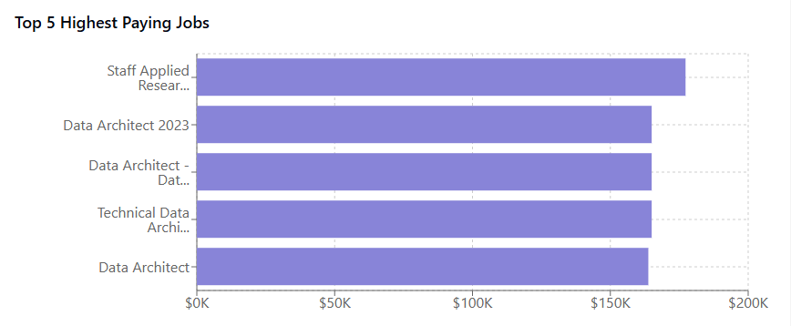
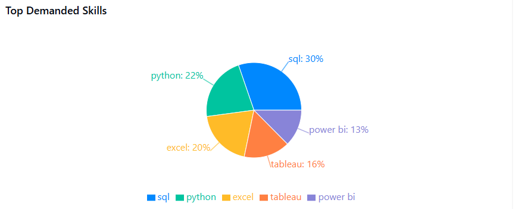
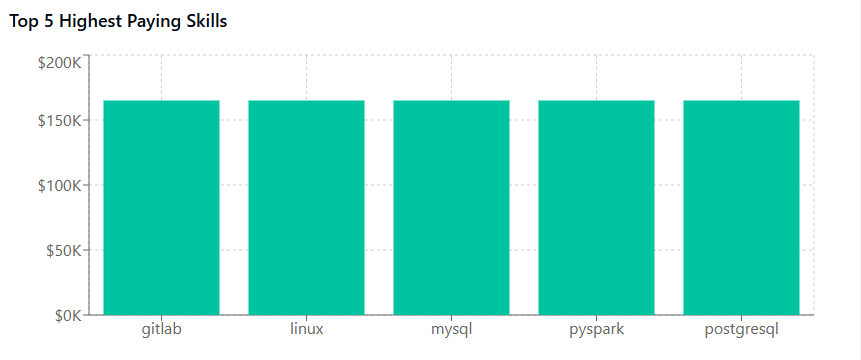
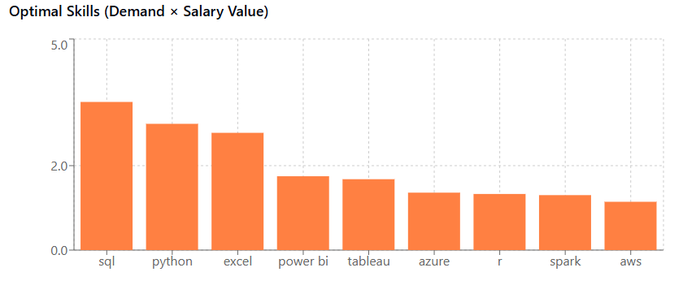

# Introduction
💡 Dive into the Indian data job market! Focusing on data analyst roles, this project explores 💰 top-paying jobs, 🔥 in-demand skills, and ✅ where high demand meets high salary in data analytics.

☕ SQL queries? Check them out here: [project_sql folder](/project_sql/)
# Background
Driven by a quest to navigate the data analyst job market more effectively, this project was born from a desire to pinpoint top-paid and in-demand skills, streamlining others work to find optimal jobs.

Data hails from Luke's [SQL Course](https://lukebarousse.com/sql) and is limited to 2023. It's packed with insights on job titles, salaries, locations, and essential skills.

### The questions I wanted to answer through my
SQL queries were:

1. What are the top-paying data analyst jobs?
2. What skills are required for these top-paying jobs?
3. What skills are most in demand for data
analysts?
4. Which skills are associated with higher
salaries?
5. What are the most optimal skills to learn?

# Tools I Used

For my deep dive into the Indian data analyst job market, I harnessed the power of several key tools:

- **SQL:** The backbone of my analysis, allowing me to query the database and unearth critical insights.
- **PostgreSQL:** The chosen database management system, ideal for handling the job posting data.
- **Visual Studio Code:** My go-to for database management and executing SQL queries.
- **Git & GitHub:** Essential for version control and sharing my SQL scripts and analysis, ensuring collaboration and project tracking.

# The Analysis
**Key Analysis Findings**

- The highest paying job is Staff Applied Research Engineer at ServiceNow with an annual salary of $177,283.
- SQL is the most in-demand skill with 1,550 job postings requiring it.
- The top 3 most valuable skills (combining demand and salary) are SQL, Python, and Excel.
- GitLab, Linux, and MySQL are among the highest-paying skills with average salaries of $165,000.
- Data Architect roles appear multiple times in the top-paying jobs list.

*Graphs visualizing the different datsets; Claude generated this
graph from my SQL query results*

*Graphs visualizing the different datsets; Claude generated this
graph from my SQL query results*

*Graphs visualizing the different datsets; Claude generated this
graph from my SQL query results*

*Graphs visualizing the different datsets; Claude generated this
graph from my SQL query results*

# What I Learned

Throughout this adventure, I've turbocharged my
SQL toolkit with some serious firepower:

- **Complex Query Crafting :** Mastered the art
of advanced SQL, merging tables like a pro and
wielding WITH clauses for ninja-level temp table
maneuvers.
- **Data Aggregation :** Got cozy with GROUP BY
and turned aggregate functions like COUNT() and AVG
() into my data-summarizing sidekicks.
- **Analytical Wizardry :** Leveled up my
real-world puzzle-solving skills, turning
questions into actionable, insightful SQL queries.

# Conclusion

### 📊 Insights

**Top Paying Jobs**

Our analysis identified the highest-paying roles in the tech industry:

Staff Applied Research Engineer at ServiceNow - $177,283/year
Data Architect roles at Bosch Group - $165,000/year
Technical Data Architect - Healthcare at Srijan Technologies - $165,000/year

These findings indicate that specialized engineering and architecture roles command the highest compensation in the current market.

**Most In-Demand Skills**

The skills with the highest demand across job postings are:

1. SQL - 1,550 job postings
2. Python - 1,120 job postings
3. Excel - 1,003 job postings

Database management and data manipulation skills continue to be foundational requirements across the industry.

**Highest Paying Skills**

The skills associated with the highest average salaries are:

1. GitLab - $165,000
2. Linux - $165,000
3. MySQL - $165,000

DevOps and infrastructure skills command premium compensation in the current market.

**Optimal Skills (High Demand × High Salary)**

When considering both demand and salary, these skills offer the best return on investment for professionals:

1. SQL - High demand (37 jobs in our sample) with average salary of $94,829
2. Python - Significant demand (30 jobs) with average salary of $99,683
3. Excel - Steady demand (31 jobs) with average salary of $89,591

### Closing Thoughts
This project enhanced my SQL skills and provided valuable insights into the data analyst job market. The findings from the analysis serve as a guide to prioritizing skill development and job search efforts. Aspiring data analysts can better position themselves in a competitive job market by focusing on high-demand, high-salary skills. This exploration highlights the importance of continuous learning and adaptation to emerging trends in the field of data analytics.

